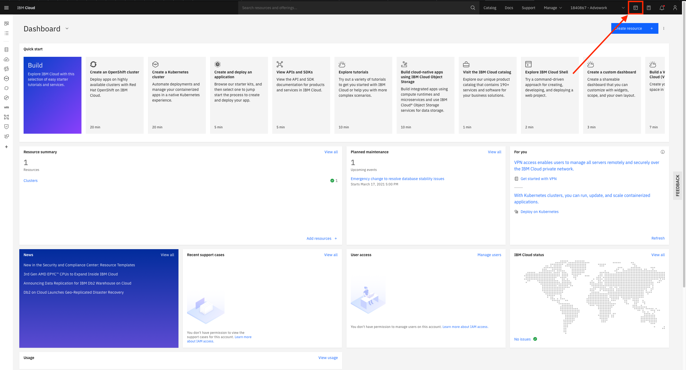
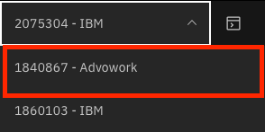

[](https://travis-ci.com/IBM/python-ubi-openshift)

#  Deploy an application to OpenShift 4 using Red Hat Universal Base Image (UBI)

This code pattern is part of the [Bee Travels project](https://github.com/bee-travels) that focuses on deploying a Python currency exchange application to OpenShift 4 using UBI


## After following this code pattern, you will understand how to:

* Design and create a Python microservice with a REST interface that has a swagger test harness where you can manually inspect, discover, and run the various API endpoints.

* Build a docker image of this microservice using the UBI
* Deploy and run this microservice on OpenShift version 4

## Architecture

This is the flow of the currency conversion microservice.


***Figure 1: Architecture flow***

1. Client API Consumer calls the microservice over the internet (http(s) request).
1. Flask process acts as a `web server` and accepts the REST request (e.g. GET /convertCurrency/ZAR/USD/600.66).
1. Code routing in Flask passes the request to a service module which in turn calls the External European Currency Exchange API (http://api.exchangeratesapi.io).
1. An exchange rate for ZAR is retrieved and stored. The value of 600.66 South African Rands (ZAR) is converted to US Dollars(USD).
1. Flask then sends a response to the calling consumer with the dollar amount (in this case, $40.59 ).


## Included components

* [IBM Cloud RedHat OpenShift version 4](https://www.ibm.com/cloud/openshift): Red Hat® OpenShift® on IBM Cloud™ is a fully managed OpenShift service that leverages the enterprise scale and security of the IBM Cloud.
* [Swagger](https://swagger.io/): A framework of API developer tools for the OpenAPI Specification that enables development across the entire API lifecycle.


## Featured technologies

* [Container Orchestration](https://www.ibm.com/cloud/container-service/) is the process of automating the deployment, scaling and management of containerized applications.

* [Microservices](https://www.ibm.com/cloud/architecture/architectures/microservices/) are an application architectural style in which an application is composed of many discrete, network-connected components called microservices.  They are collections of fine-grained, loosely coupled services intercommunicating via a lightweight protocol to provide building blocks in modern application composition in the cloud.

* [Python](https://www.python.org/) is a programming language that lets you work quickly and integrate systems more effectively.

* [Flask](https://flask.palletsprojects.com/en/1.1.x/) is a [microframework](https://en.wikipedia.org/wiki/Flask_(web_framework)) written in Python. It is classified as a microframework because it does not require particular tools or libraries.

# Steps

## Create API key and Private Container Registry

Create a shell environment on your account.



Configure your container image registry

```bash
ic resource groups 
ic target -g Default
ic iam api-key-create ypyp-api-key --file ypyp-api-key
ic cr region-set
ic cr namespace-add ypyp-registry
ic cr namespace-list -v
ic cr image-list
```


## Build and run a docker image 

### Clone the project

Navigate to https://labs.play-with-docker.com/
Create a Docker Account if it does not exists.

Clone the `currencyexchange` GitHub repository locally.

```bash
git clone https://github.com/IBM/python-ubi-openshift.git
cd python-ubi-openshift
```

### What is UBI?

#### Take a look at our [Dockerfile](./Dockerfile) and notice the `FROM` directive is using the UBI version 8 (core of Red Hat 8) base image.

```yaml
FROM registry.access.redhat.com/ubi8/ubi
```

#### Introducing UBI

At the core of containers there is a lighter weight Linux operating system. Most of us may have used Ubuntu or Alpine as the base Operating system.

Red Hat now offers us a good alternative base image, that is essentially the core
of Red Hat Enterprise Linux.  Much like CentOS and Red Hat Enteprise linux derive it's core elements from the OpenSource Fedora project.

This ***Linux alternative from Red Hat*** is called the Red Hat Universal Base Image (UBI).

The UBI comes in a few flavors:

1.  You can choose one of the three base images (`ubi`, `ubi-minimal` and `ubi-init`)
1.  Or language-specific runtime images (e.g. `node.js`, `python`, etc.)

UBI allows one to use associated packages provided by `YUM repositories` which satisfy common application dependencies, like `httpd` (apache web server) etc.

### Build & Run & Push container image

1. Build the docker image by running:

```bash
export CR_REGION=de.icr.io
export CR_NAMESPACE=ypyp-registry
docker build -t $CR_REGION/$CR_NAMESPACE/currencyexchange-py
```

2. Great! So, now lets run the image locally!

```bash
docker run -p 7878:7878 $CR_REGION/$CR_NAMESPACE/currencyexchange-py
```


At your command line run: `docker ps` and you should now confirm that the docker container for the currencyexchange microservice is up and running.


> Explore the microservice from your browser at
> [http://127.0.0.1:7878](http://127.0.0.1:7878) for documentation about this API's endpoints and a `try-it-out` test harness to actually run the API calls.


3. Lets push the image to the container registry:
```
echo <api-key> | docker login -u "iamapikey" --password-stdin $CR_REGION

# push image to docker hub
docker push $CR_REGION/$CR_NAMESPACE/currencyexchange-py
```


## Deploy to OpenShift 4 cluster

### Login to your OpenShift 4 cluster

Switch Account to Advowordk



Launch the `Web Console` by clicking on the blue and white button ( annotated with a number(1) above )


Once in the OpenShift Web Console screen, click on your username and choose 


Click on the `Copy login command` dropdown option under your username


By clicking on display token hyperlink will reveal your oc login token and command.


use `oc login ... ` to login to your cluster, for example 
```sh
oc login --token=X8bjO-ROAhGUx8S9pvg6767574ysuG9SSgSI6hyg --server=https://c108-e.us-northwest.containers.cloud.ibm.com:31007
```

create a new project

```bash
oc new-project currencyexchange-py
```

next add a new application

```bash
export CR_REGION=de.icr.io
export CR_NAMESPACE=ypyp-registry
oc create secret docker-registry container-registry --docker-server=de.icr.io --docker-email=unused --docker-username=iamapikey --docker-password=<api-key> 
oc secrets link default container-registry --for=pull
oc secrets link builder container-registry
oc new-app $CR_REGION/$CR_NAMESPACE/currencyexchange-py
```

Great!  Now you should see


Note the yellow highlight section confirms that the RedHat UBI is the base image in your docker deployment.

Almost there!  You will need to expose the microservice to the outside world by executing

```bash
oc expose svc/currencyexchange-py

#expected output
> route.route.openshift.io/currencyexchange-py exposed

#get the external URL to access the microservice
oc status

```
You should see `oc status` commands output similar to this


Now the route is exposed externally and will be visible via the public internet.

### Accessing the microservice over the world wide web

You can now access the currency exchange microservice running inside your OpenShift cluster by navigating to URL, ( see the figure above, where the URL is highlighted in purple).

You should now see the Flask generated swagger RESTful API as an interactive test harness in a web page, where you can explore and manually test the Currency Conversion microservice:


### Performance and health monitoring of your microserive 

You can examine the `health` of your microsevice with the `OpenShift Web Console Dashboard` 


Here you can monitor your `currency exchange microservice` cluster.  See and adust the number of pods, the more pods the more resiliant and responsize your microservice will behave under load.  You can also see the Bandwidth, Memory, CPU and disk utilization.


### Congratulations!  

You have now successfully created a Python Flask microservice container image, using the UBI, and optionally deployed it to a Red Hat OpenShift 4 cluster on the IBM Cloud.


# Resources
[Introducing the Red Hat Universal Base Image ](https://www.redhat.com/en/blog/introducing-red-hat-universal-base-image) - RedHat blog by Scott McCarty


[Python RESTful APIs using flask-restplus](https://pypi.org/project/flask-restplus/)


## License

This code pattern is licensed under the Apache License, Version 2. Separate third-party code objects invoked within this code pattern are licensed by their respective providers pursuant to their own separate licenses. Contributions are subject to the [Developer Certificate of Origin, Version 1.1](https://developercertificate.org/) and the [Apache License, Version 2](https://www.apache.org/licenses/LICENSE-2.0.txt).

[Apache License FAQ](https://www.apache.org/foundation/license-faq.html#WhatDoesItMEAN)

